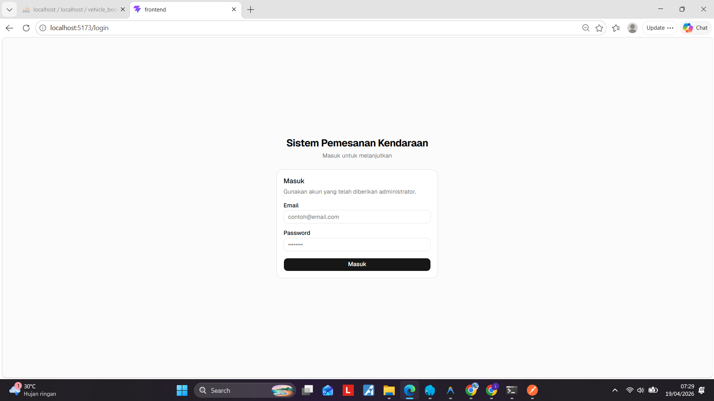
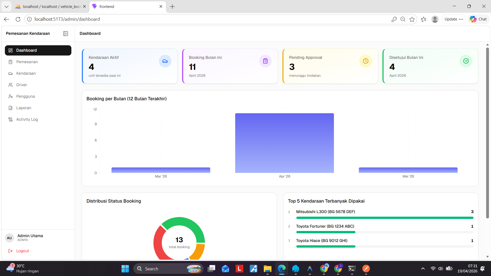
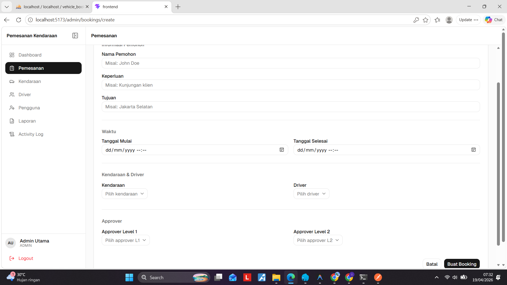
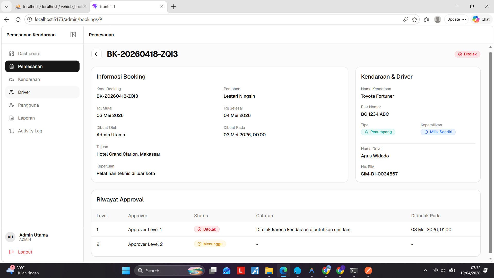
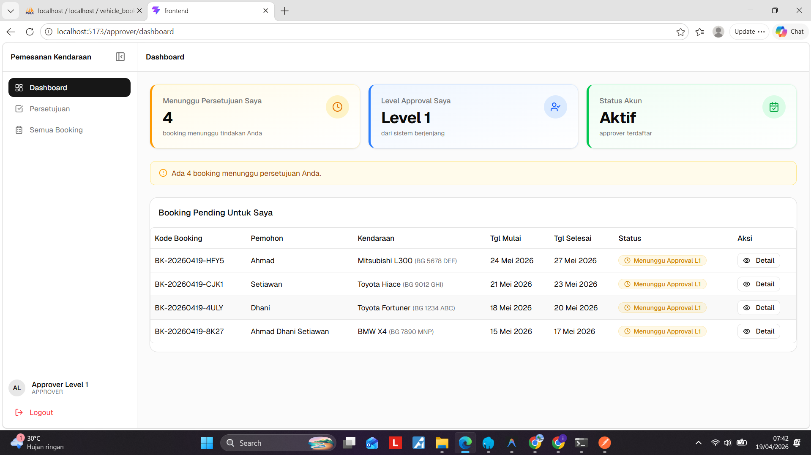
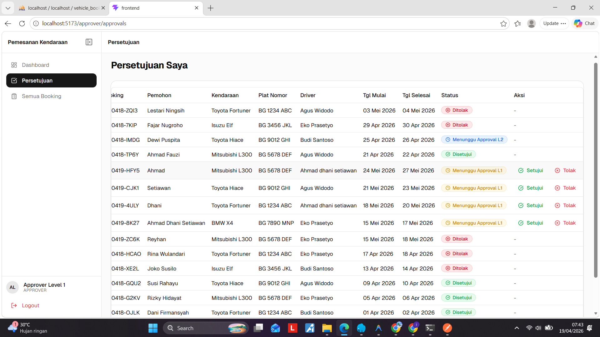
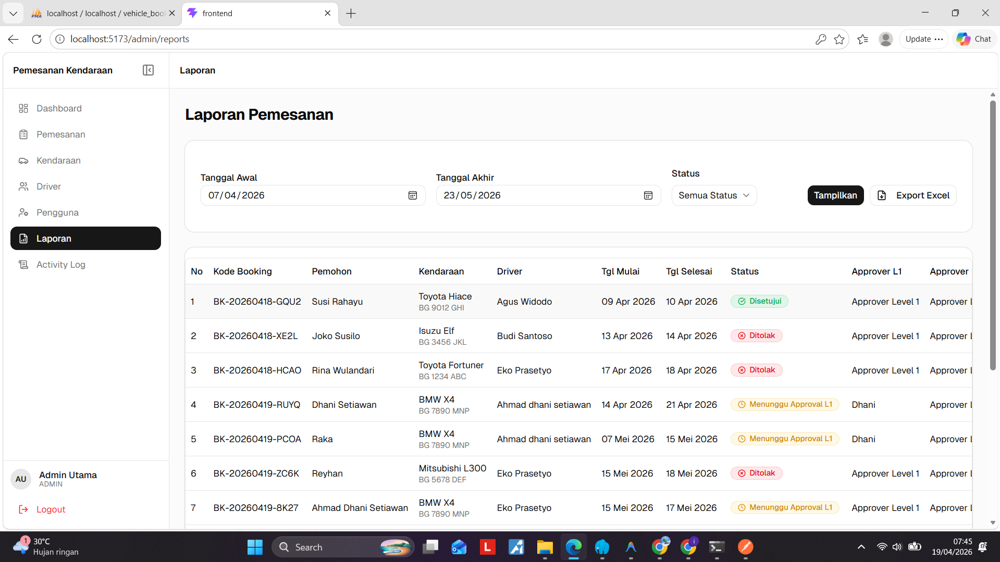
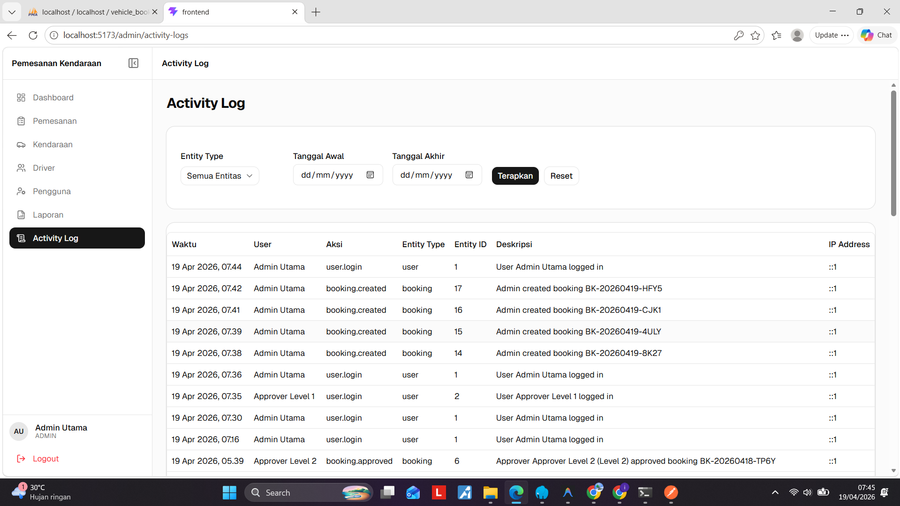

# Sistem Pemesanan Kendaraan

Aplikasi web manajemen dan pemesanan kendaraan perusahaan tambang nikel dengan approval berjenjang 2 level.

---

## Tech Stack

| Layer    | Technology                  | Version    |
|----------|-----------------------------|------------|
| Backend  | PHP + CodeIgniter 4         | PHP 8.2.30 |
| Frontend | React + Vite + Tailwind CSS | React 19   |
| Database | MySQL                       | 8.0.45     |
| Auth     | JWT (manual)                | —          |

---

## Fitur

- Manajemen master data: kendaraan, driver, user
- Pemesanan kendaraan oleh admin dengan penentuan driver dan approver
- Approval berjenjang 2 level
- Dashboard dengan grafik pemakaian kendaraan
- Laporan periodik pemesanan dengan export Excel
- Log aktivitas aplikasi pada setiap proses
- UI responsif untuk desktop dan mobile

---

## Requirement

- PHP >= 8.2
- Composer
- Node.js >= 18
- MySQL >= 8.0

---

## Instalasi

### Backend

```bash
cd backend
composer install
cp env .env
```

Edit `.env` — isi kredensial database dan `jwt.secret`.

```bash
php spark migrate
php spark db:seed MainSeeder
php spark serve --port=8080
```

### Frontend

```bash
cd frontend
npm install
```

Pastikan `.env` berisi:

```
VITE_API_URL=http://localhost:8080/api
```

```bash
npm run dev
```

Akses di `http://localhost:5173`

---

## Akun Default

| Role             | Email                 | Password |
|------------------|-----------------------|----------|
| Admin            | admin@vehicle.com     | password |
| Approver Level 1 | approver1@vehicle.com | password |
| Approver Level 2 | approver2@vehicle.com | password |

---

## Panduan Penggunaan

### Admin

- Login dengan akun admin
- **Master Data**: kelola kendaraan, driver, user via sidebar
- **Buat Booking**: isi form, pilih kendaraan, driver, approver L1 dan L2, submit
- **Monitor status booking** di menu Pemesanan
- **Laporan**: set filter tanggal → Cari → Export Excel
- **Activity Log**: pantau semua aktivitas sistem

### Approver

- Login dengan akun approver
- Dashboard menampilkan jumlah booking menunggu persetujuan
- **Menu Persetujuan Saya**: lihat daftar booking yang di-assign
- Review detail booking → Setujui atau Tolak (tolak wajib isi alasan)
- Level 2 baru bisa act setelah Level 1 menyetujui

---

## Dokumen Tambahan

- `docs/physical-data-model.png` — Physical Data Model
- `docs/activity-diagram.png` — Activity Diagram (import ke draw.io)

---

## Screenshot

### Login


### Dashboard Admin


### Buat Booking


### Detail Booking


### Dashboard Approver


### Persetujuan


### Laporan


### Activity Log

