<div align="center">

# 🚗 Sistem Pemesanan Kendaraan

**Manajemen armada & pemesanan kendaraan operasional perusahaan tambang nikel**
dengan approval berjenjang 2 level, pencegahan double-booking, dan audit trail lengkap.

---


</div>

---

## Mengapa Aplikasi Ini Dibutuhkan?

> Perusahaan tambang nikel beroperasi di banyak lokasi — tambang, kantor cabang, kantor pusat — dengan armada kendaraan yang dipakai lintas departemen. Pengelolaan manual menciptakan masalah serius:

<table>
<tr>
<td width="50%">

**❌ Sebelum**
- Booking lewat WhatsApp/email → mudah bentrok
- Tidak ada giliran persetujuan → kendaraan dipakai tanpa otorisasi
- Tidak bisa lacak siapa pakai kendaraan apa & kapan
- Race condition: 2 admin booking kendaraan sama secara bersamaan

</td>
<td width="50%">

**✅ Sesudah**
- Pemesanan terpusat dengan validasi real-time
- Approval berjenjang 2 level yang ketat & terurut
- Audit trail lengkap setiap aktivitas pengguna
- Pessimistic row locking mencegah double-booking

</td>
</tr>
</table>

---

## Arsitektur Sistem

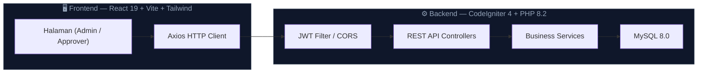
```mermaid
graph LR
    subgraph FE["🖥️  Frontend — React 19 + Vite + Tailwind"]
        UI["Halaman (Admin / Approver)"]
        AX["Axios HTTP Client"]
    end

    subgraph BE["⚙️  Backend — CodeIgniter 4 + PHP 8.2"]
        MW["JWT Filter / CORS"]
        API["REST API Controllers"]
        SVC["Business Services"]
        DB["MySQL 8.0"]
    end

    UI --> AX --> MW --> API --> SVC --> DB

    style FE fill:#0f172a,color:#94a3b8,stroke:#334155
    style BE fill:#0f172a,color:#94a3b8,stroke:#334155
```

---

## Alur Persetujuan Booking

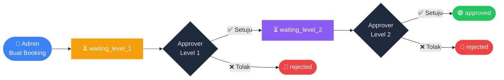
```mermaid
flowchart LR
    A(["👤 Admin\nBuat Booking"]) --> B

    B["⏳ waiting_level_1"]
    B --> C{"Approver\nLevel 1"}
    C -->|"✅ Setuju"| D["⏳ waiting_level_2"]
    C -->|"❌ Tolak"| R1(["🔴 rejected"])

    D --> E{"Approver\nLevel 2"}
    E -->|"✅ Setuju"| F(["🟢 approved"])
    E -->|"❌ Tolak"| R2(["🔴 rejected"])

    style A  fill:#3b82f6,color:#fff,stroke:none
    style B  fill:#f59e0b,color:#fff,stroke:none
    style D  fill:#8b5cf6,color:#fff,stroke:none
    style F  fill:#22c55e,color:#fff,stroke:none
    style R1 fill:#ef4444,color:#fff,stroke:none
    style R2 fill:#ef4444,color:#fff,stroke:none
    style C  fill:#1e293b,color:#e2e8f0,stroke:#475569
    style E  fill:#1e293b,color:#e2e8f0,stroke:#475569
```

> **Aturan penting:** Approver Level 2 baru bisa bertindak setelah Level 1 menyetujui. Penolakan di level manapun langsung mengubah status menjadi `rejected` (final). Admin pembuat **tidak boleh** menjadi Approver sendiri.

---

## Fitur Utama

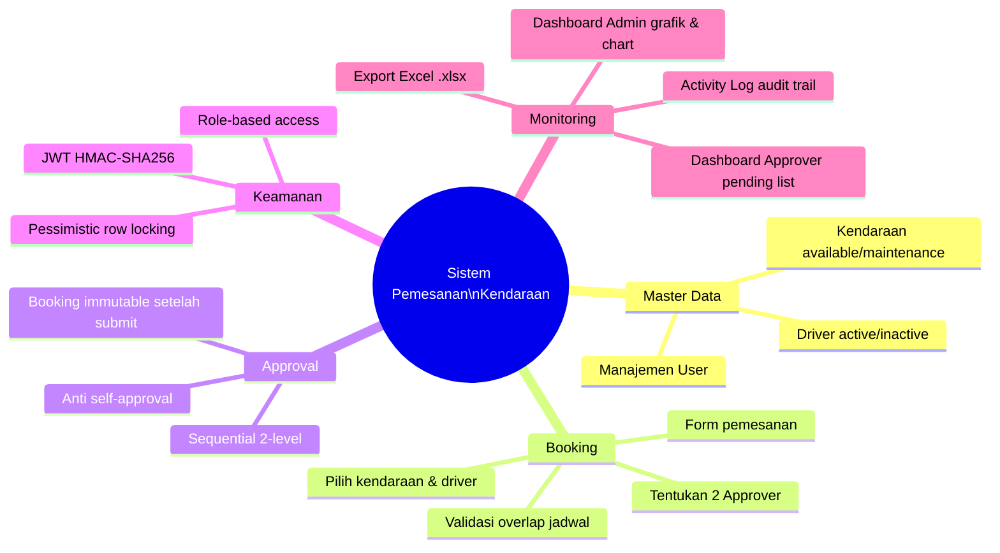
```mermaid
mindmap
  root((Sistem Pemesanan\nKendaraan))
    Master Data
      Kendaraan available/maintenance
      Driver active/inactive
      Manajemen User
    Booking
      Form pemesanan
      Pilih kendaraan & driver
      Tentukan 2 Approver
      Validasi overlap jadwal
    Approval
      Sequential 2-level
      Anti self-approval
      Booking immutable setelah submit
    Keamanan
      JWT HMAC-SHA256
      Role-based access
      Pessimistic row locking
    Monitoring
      Dashboard Admin grafik & chart
      Dashboard Approver pending list
      Activity Log audit trail
      Export Excel .xlsx
```

---

## Matriks Otorisasi

| Fitur | Admin | Approver |
| :--- | :---: | :---: |
| Login / Logout | ✅ | ✅ |
| CRUD Master Data (Kendaraan, Driver, User) | ✅ | ❌ |
| Buat Pemesanan Baru | ✅ | ❌ |
| Lihat Daftar & Detail Booking | ✅ semua | ✅ yang di-assign |
| Approve / Reject Booking | ❌ | ✅ sesuai giliran level |
| Dashboard Analitik | ✅ grafik & statistik | ✅ pending list |
| Export Laporan Excel | ✅ | ❌ |
| Audit Log Aktivitas | ✅ | ❌ |

---

## Tech Stack

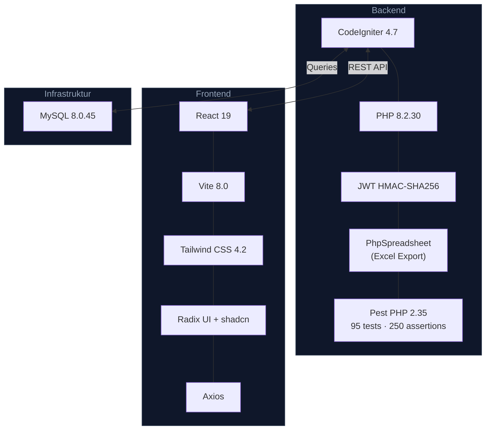
```mermaid
graph TD
    subgraph Backend
        CI4["CodeIgniter 4.7"]
        PHP["PHP 8.2.30"]
        JWT["JWT HMAC-SHA256"]
        PSS["PhpSpreadsheet\n(Excel Export)"]
        PEST["Pest PHP 2.35\n95 tests · 250 assertions"]
    end

    subgraph Frontend
        RCT["React 19"]
        VITE["Vite 8.0"]
        TW["Tailwind CSS 4.2"]
        RADIX["Radix UI + shadcn"]
        AXIOS["Axios"]
    end

    subgraph Infrastruktur
        MYSQL["MySQL 8.0.45"]
    end

    CI4 --- PHP --- JWT --- PSS --- PEST
    RCT --- VITE --- TW --- RADIX --- AXIOS
    CI4 <-->|"REST API"| RCT
    CI4 <-->|"Queries"| MYSQL

    style Backend  fill:#0f172a,color:#94a3b8,stroke:#334155
    style Frontend fill:#0f172a,color:#94a3b8,stroke:#334155
    style Infrastruktur fill:#0f172a,color:#94a3b8,stroke:#334155
```

---

## Screenshot

<table>
<tr>
<td align="center" width="50%">

**Login**
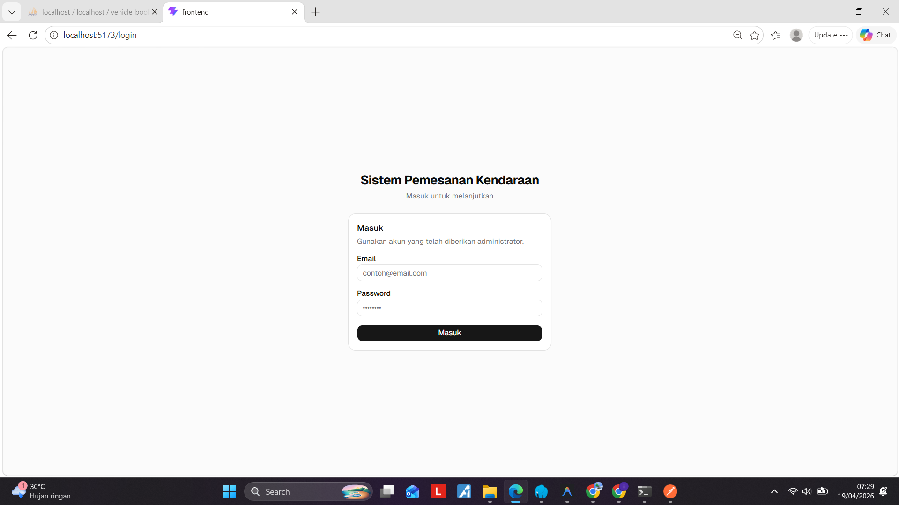

</td>
<td align="center" width="50%">

**Dashboard Admin**
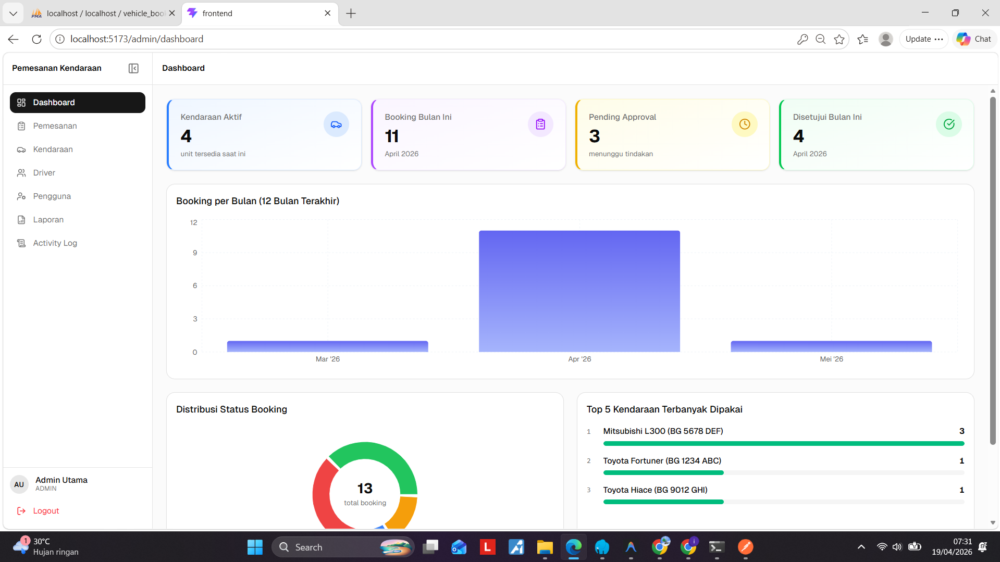

</td>
</tr>
<tr>
<td align="center" width="50%">

**Buat Booking**
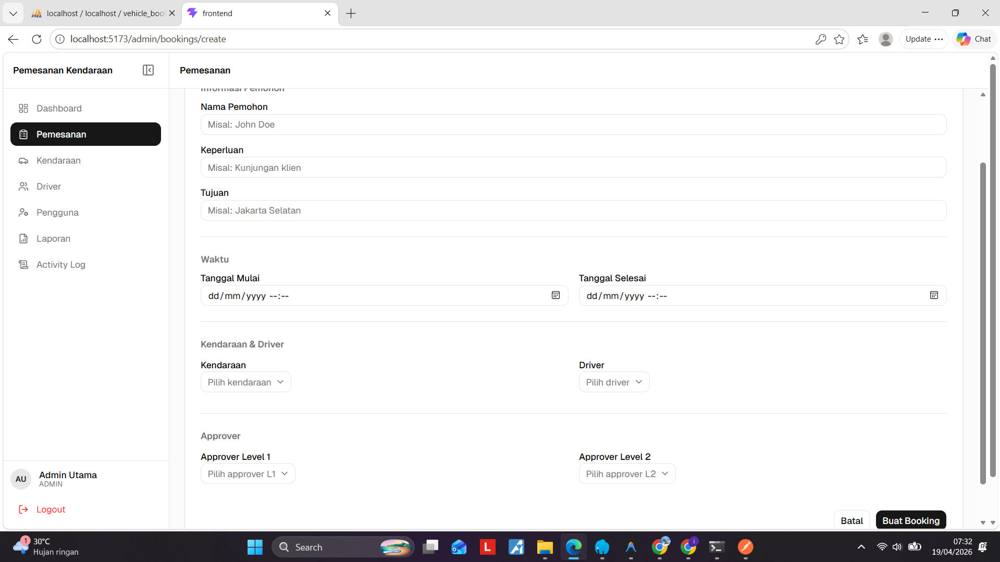

</td>
<td align="center" width="50%">

**Detail Booking**
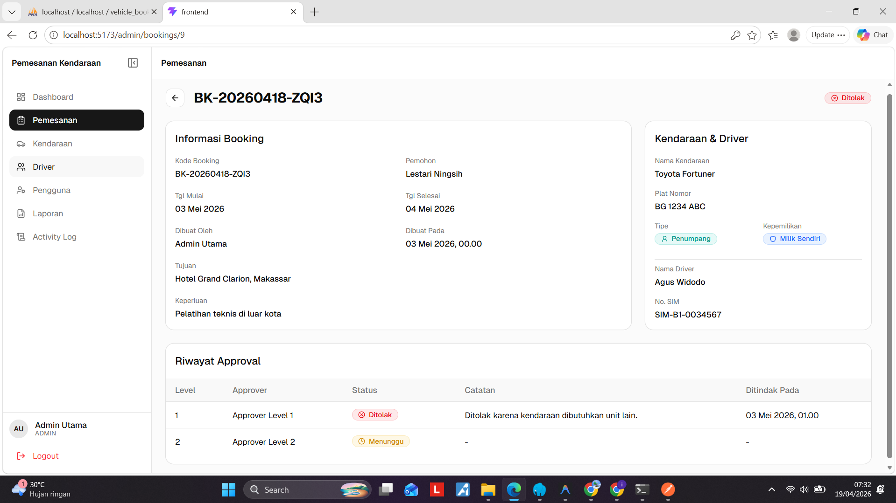

</td>
</tr>
<tr>
<td align="center" width="50%">

**Dashboard Approver**
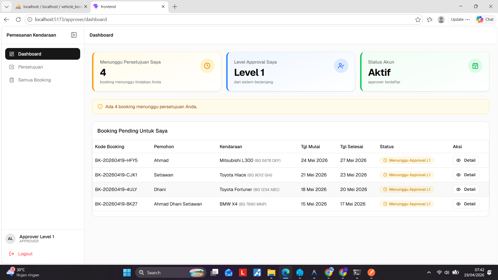

</td>
<td align="center" width="50%">

**Proses Persetujuan**
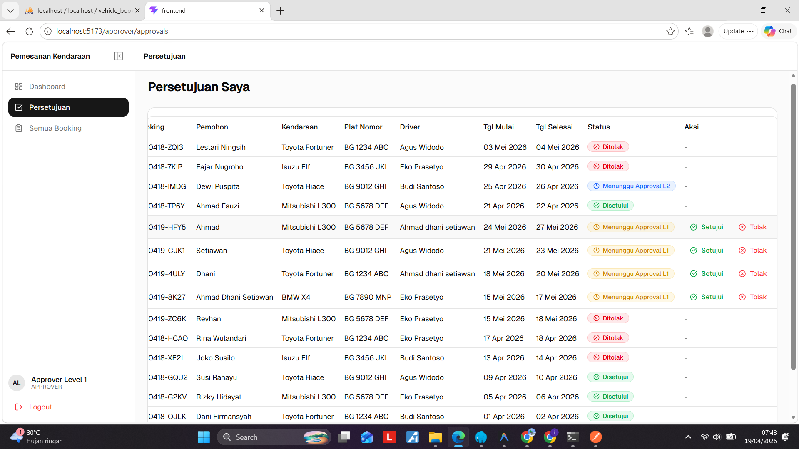

</td>
</tr>
<tr>
<td align="center" width="50%">

**Laporan & Export**
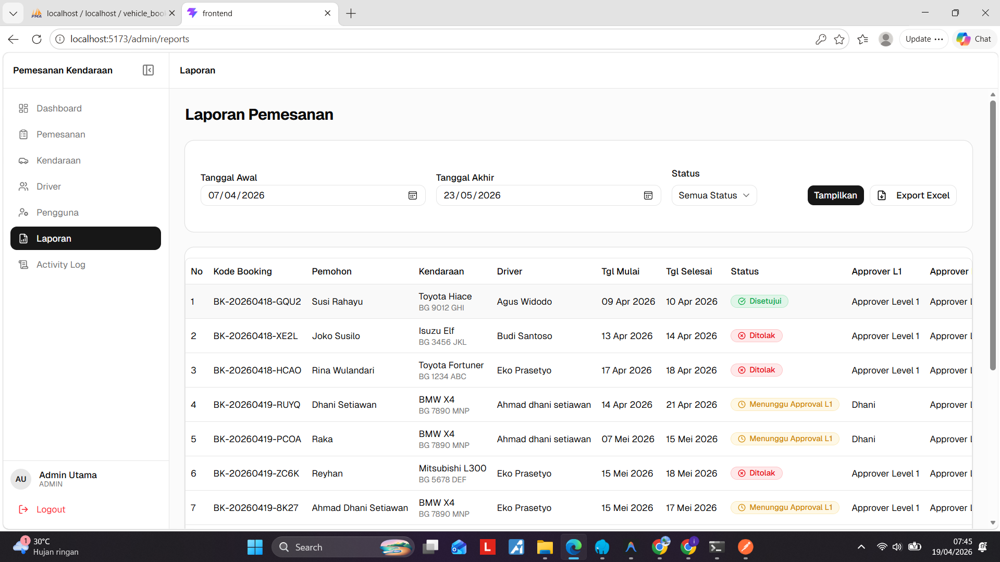

</td>
<td align="center" width="50%">

**Activity Log**
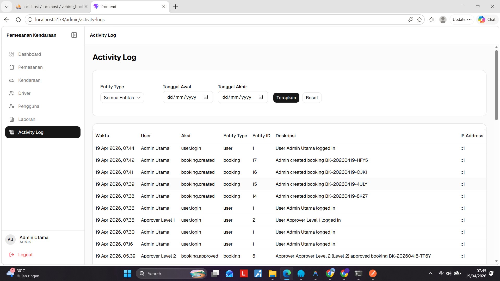

</td>
</tr>
</table>

---

## Instalasi

### Requirement


### Backend

```bash
cd backend
composer install
cp env .env
```

Edit `.env` — sesuaikan koneksi database & JWT secret:

```env
database.default.hostname = localhost
database.default.database = vehicle_booking
database.default.username = root
database.default.password =

jwt.secret = "your_secret_key_min_32_chars_long"
```

Migrasi & seed data awal:

```bash
# Shortcut (migrate + seed sekaligus)
composer db:reset

# Atau manual:
php spark migrate
php spark db:seed MainSeeder
```

```bash
# Jalankan backend
php spark serve --port=8080
```

### Frontend

```bash
cd frontend
npm install
```

Pastikan `frontend/.env` berisi:

```env
VITE_API_URL=http://localhost:8080/api
```

```bash
# Jalankan frontend
npm run dev
# → http://localhost:5173
```

---

## Pengujian Otomatis

```bash
cd backend
vendor/bin/pest
```

| Cakupan | Detail |
| :--- | :--- |
| **JWT Auth** | Generate, decode, expired token, invalid secret |
| **Booking Validation** | Overlap jadwal, self-approval, sequence level, immutability |
| **Concurrency Control** | Pessimistic row locking, race condition |
| **Role Authorization** | Admin-only endpoints, approver-only endpoints |
| **Report & Export** | Filter tanggal, status, output `.xlsx` |
| **Audit Logging** | Pencatatan setiap aksi ke `activity_logs` |

> **Total: 95 tests · 250 assertions** — semua wajib hijau sebelum merge

---

## Akun Default

> Data tersedia setelah menjalankan `composer db:reset` atau `php spark db:seed MainSeeder`

| Role | Email | Password |
| :--- | :--- | :--- |
| **Admin** | `admin@vehicle.com` | `password` |
| **Approver Level 1** | `approver1@vehicle.com` | `password` |
| **Approver Level 2** | `approver2@vehicle.com` | `password` |

---

## Panduan Singkat

<details>
<summary><strong>👤 Panduan Admin</strong></summary>

1. Login → `admin@vehicle.com` / `password`
2. **Master Data** — Kelola kendaraan, driver, user via sidebar
3. **Buat Booking** — Isi form, pilih kendaraan, driver, Approver L1 & L2, lalu submit
4. **Monitor** — Pantau status booking di menu Pemesanan
5. **Laporan** — Set filter tanggal → Cari → Export Excel `.xlsx`
6. **Activity Log** — Audit seluruh aktivitas sistem

</details>

<details>
<summary><strong>✅ Panduan Approver</strong></summary>

1. Login → `approver1@vehicle.com` atau `approver2@vehicle.com` / `password`
2. Dashboard menampilkan jumlah booking yang menunggu giliran persetujuan
3. **Menu Persetujuan Saya** — Lihat daftar booking yang di-assign
4. Review detail → **Setujui** atau **Tolak** (wajib isi alasan jika tolak)
5. Approver Level 2 hanya bisa bertindak setelah Level 1 menyetujui

</details>

---

## Dokumen Referensi

| Dokumen | Deskripsi |
| :--- | :--- |
| [docs/schema.md](docs/schema.md) | Skema database, relasi tabel, dan constraint |
| [docs/api-contract.md](docs/api-contract.md) | Kontrak REST API lengkap (endpoint, payload, response) |
| [docs/PROJECT_CONTEXT.md](docs/PROJECT_CONTEXT.md) | Konteks bisnis, spesifikasi, dan matriks otorisasi |
| [docs/images/physical-data-model.png](docs/images/physical-data-model.png) | Physical Data Model (ERD) |
| [docs/images/activity-diagram.png](docs/images/activity-diagram.png) | Activity Diagram (import ke draw.io) |

---

<div align="center">

Dilisensikan di bawah **[MIT License](LICENSE)**

</div>
