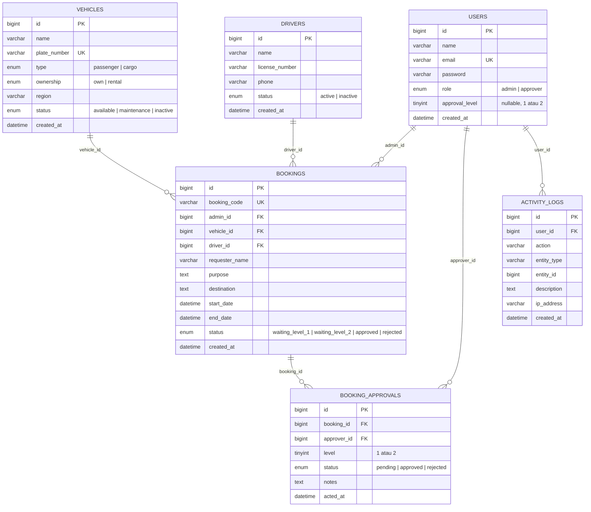

# Database Schema & Business Logic Constraints — Vehicle Booking System

Dokumen ini berisi dokumentasi skema database dan aturan bisnis (business logic) aktual yang telah diverifikasi langsung terhadap seluruh file Migration (`backend/app/Database/Migrations/`), Model (`backend/app/Models/`), Service (`backend/app/Services/`), dan API Controller (`backend/app/Controllers/Api/`).

---

## Database Constraints (Constraint Tingkat Database)

1. **Unique Composite Key (`booking_approvals`)**:
   - Primary key: `id`
   - Unique Composite Key: `(booking_id, level)` — Memastikan tidak ada duplikasi record approval pada level yang sama untuk satu booking.
2. **Foreign Key Integrity (`ON DELETE RESTRICT`)**:
   - `bookings.admin_id` → `users.id` (`ON DELETE RESTRICT`, `ON UPDATE RESTRICT`)
   - `bookings.vehicle_id` → `vehicles.id` (`ON DELETE RESTRICT`, `ON UPDATE RESTRICT`)
   - `bookings.driver_id` → `drivers.id` (`ON DELETE RESTRICT`, `ON UPDATE RESTRICT`)
   - `booking_approvals.approver_id` → `users.id` (`ON DELETE RESTRICT`, `ON UPDATE RESTRICT`)
   - `activity_logs.user_id` → `users.id` (`ON DELETE RESTRICT`, `ON UPDATE RESTRICT`)
   - _Dampak:_ Master data (`users`, `vehicles`, `drivers`) tidak dapat dihapus jika masih direferensikan oleh pemesanan.
3. **Cascade Deletion (`ON DELETE CASCADE`)**:
   - `booking_approvals.booking_id` → `bookings.id` (`ON DELETE CASCADE`, `ON UPDATE CASCADE`)
   - _Dampak:_ Jika record `bookings` dihapus, seluruh history approval terkait akan otomatis terhapus.

---

## Application Business Rules (Hasil Verifikasi Kode Application Layer)

Telah diverifikasi terhadap `BookingService.php`, `BookingController.php`, `UserController.php`, `VehicleController.php`, dan `DriverController.php`:

### 1. Format `booking_code`

- Di-generate otomatis oleh `BookingService::generateBookingCode()` dengan format: **`BK-YYYYMMDD-XXXX`** (misal: `BK-20260418-A7B9`).
- `XXXX` berupa 4 karakter acak alfanumerik (`0-9`, `A-Z`).
- Memiliki proteksi pengecekan keunikan hingga 10 iterasi jika terjadi collision.

### 2. Pengecekan Overlap & Availability (Pemesanan Kendaraan & Driver)

- **Kendaraan:** Harus berstatus `available` (`VehicleModel`).
- **Driver:** Harus berstatus `active` (`DriverModel`).
- **Pengecekan Jarak Waktu (Date Range Overlap):** `BookingService::isVehicleAvailable()` dan `isDriverAvailable()` memastikan tidak ada bentrok waktu pemesanan untuk status booking `waiting_level_1`, `waiting_level_2`, atau `approved`.
  - Formula overlap: `(start_date < $newEndDate) AND (end_date > $newStartDate)`.

### 3. Alur Persetujuan Bertingkat (Sequential 2-Level Approval Chain)

- HTTP Request `POST /api/bookings` mengirimkan payload `approver_level1_id` dan `approver_level2_id` (keduanya adalah **parameter request API**, bukan kolom tabel `bookings`).
- Validation controller memastikan:
  - Approver Level 1 (`approver_level1_id`): Harus user dengan `role = 'approver'` dan `approval_level = 1`.
  - Approver Level 2 (`approver_level2_id`): Harus user dengan `role = 'approver'` dan `approval_level = 2`.
- `BookingService::createBooking()` menerima parameter ini untuk langsung menyisipkan **2 baris terpisah** ke dalam tabel `booking_approvals` (`level = 1` dan `level = 2`).
- Status Transisi:
  1. Saat pemesanan dibuat $\rightarrow$ Status Booking: `waiting_level_1`, Status Approval L1 & L2 di `booking_approvals`: `pending`.
  2. Saat Approver Level 1 menyetujui $\rightarrow$ Status Booking menjadi `waiting_level_2`, Status Approval L1 menjadi `approved`.
  3. Saat Approver Level 2 menyetujui $\rightarrow$ Status Booking menjadi `approved`, Status Approval L2 menjadi `approved`.
  4. Jika salah satu Approver menolak $\rightarrow$ Status Booking langsung menjadi `rejected`, Status Approval terkait menjadi `rejected`, dan wajib menyertakan alasan penolakan (`notes`).

### 4. Pencegahan Self-Approval

- Validasi pada controller memverifikasi bahwa ID Admin yang sedang login (`admin_id`) tidak sama dengan `approver_level1_id` maupun `approver_level2_id` pada payload request (`(int)$approver_id !== (int)$admin_id`).

### 5. Immutability Pemesanan (Immutable After Submit)

- Pemesanan yang telah disubmit tidak dapat diubah (edit/update) oleh Admin. API hanya menyediakan endpoint `index`, `show`, `create`, `approve`, dan `reject`.

### 6. Catatan Audit (Audit Trail Logging)

- Setiap aktivitas sistem (pembuatan/persetujuan/penolakan booking, manajemen master data user/kendaraan/driver, serta login) dicatat secara otomatis ke tabel `activity_logs` via `ActivityLogService`.
